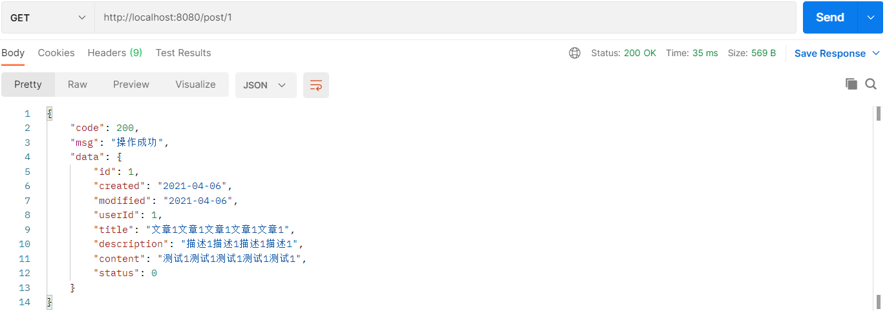
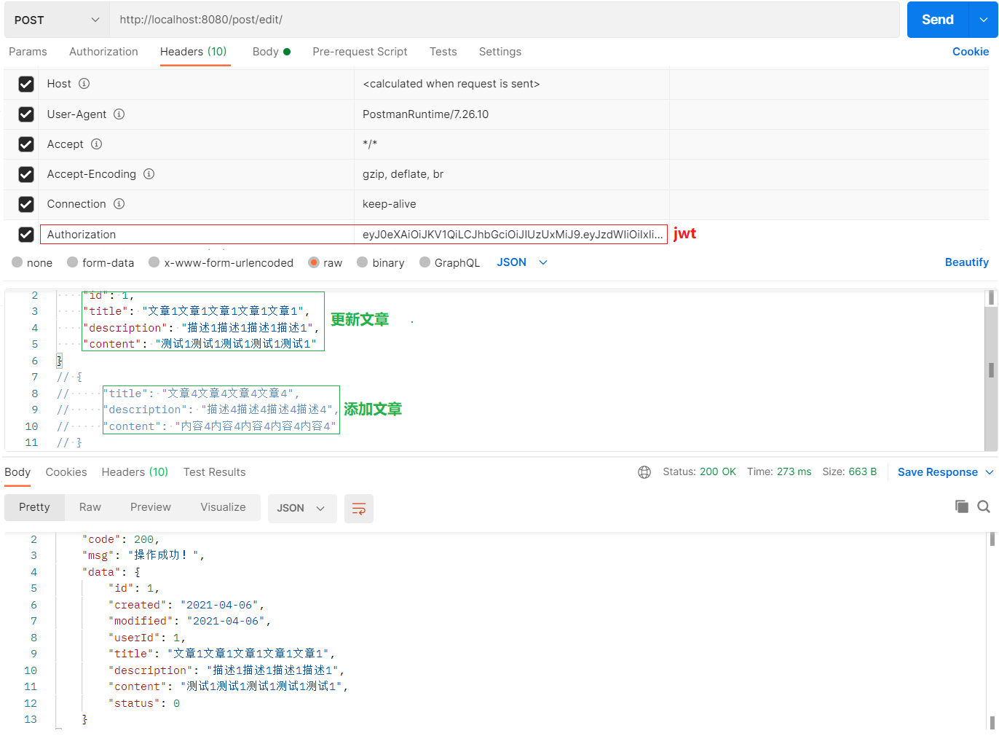

# 5. 集成 Shiro-Redis、Jwt 开发项目接口

```text
blog-tiny
└─src
    └─main
        ├─java
        │  └─org
        │      └─org.myslayers
        │          ├─controller
        │          │      UserController.java   # 项目接口
```

## 5.1 集成 Shiro-Redis、Jwt 开发项目接口

```java
@RestController
public class PostController extends BaseController {

    @Autowired
    PostService PostService;
    
    /**
     * 【查询】全部文章
     */
    @GetMapping("/post/list")
    public Result list(@RequestParam(defaultValue = "1") Integer currentPage) {
        IPage pageData = PostService.page(new Page(currentPage, 5), new QueryWrapper<Post>().orderByDesc("created"));
        return Result.success("操作成功！", pageData);
    }

    /**
     * 【查看】文章
     */
    @GetMapping("/post/{id}")
    public Result detail(@PathVariable(name = "id") Long id) {
        Post post = PostService.getById(id);
        Assert.notNull(post, "该博客已被删除");
        return Result.success("操作成功", post);
    }

    /**
     * 【更新/添加】文章
     */
    @RequiresAuthentication
    @PostMapping("/post/edit")
    public Result edit(@Validated @RequestBody Post post) {
        Post temp = null;

        /**
         * 编辑文章：存在文章id，则判断【是否拥有权限编辑该篇文章】
         */
        if (post.getId() != null) {
            // 登录成功之后返回的登录用户的id 与 当前操作的文章的用户id 比较，判断【是否拥有权限编辑该篇文章】
            temp = PostService.getById(post.getId());
            Assert.isTrue(temp.getUserId().longValue() == getProfile().getId().longValue(), "没有权限编辑该篇文章！");
        } else {
            /**
             * 添加文章：不存在文章id，则进行字段补充，将post添加至数据库
             */
            // 对传入的post文章，进行字段补充，比如userId、status、created
            temp = new Post();
            temp.setUserId(getProfile().getId());
            temp.setStatus(0);
            temp.setCreated(new Date());
            temp.setModified(new Date());
        }

        // 从 post 拷贝至 temp，忽略"id", "userId", "created", "status"
        BeanUtil.copyProperties(post, temp, "id", "userId", "created", "status", "modified");
        PostService.saveOrUpdate(temp);

        return Result.success("操作成功！", temp);
    }
}
```

- 效果图如下：
- 效果图如下：
- 效果图如下：
